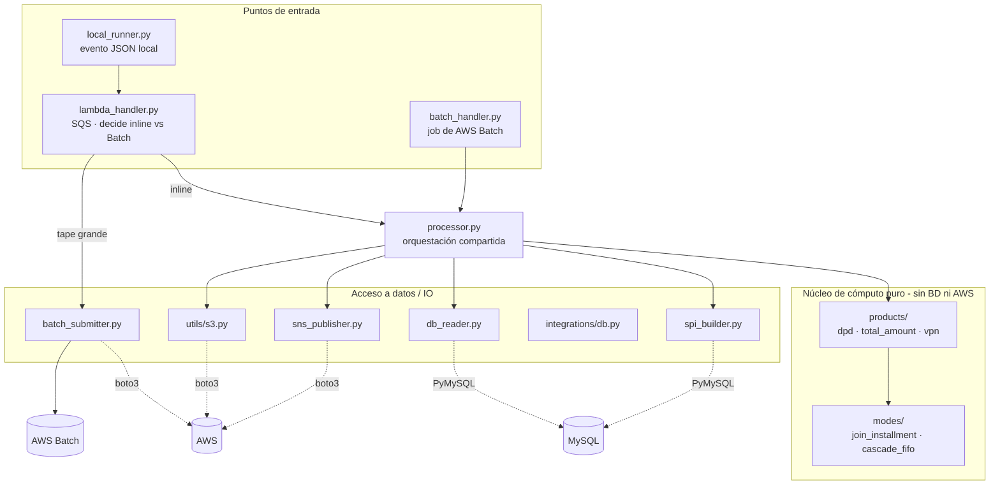

# Principios de arquitectura

Reglas de capas, dirección de dependencias y qué puede importar qué en el paquete `dpd/`.

## Idea central: núcleo de cómputo puro + orquestación compartida

El cálculo de DPD **no conoce ni BD ni AWS**. La lógica pura vive en `modes/` y `products/` y opera sobre
listas de dicts / polars DataFrames ya sanitizados. El orquestador `processor.py` lee datos, corre los productos
y escribe los resultados; lo comparten los dos puntos de entrada productivos (Lambda y Batch).

## Reglas de dependencia

| Capa | Puede importar | NO debe importar |
|------|----------------|------------------|
| `modes/` (cómputo puro) | `config.RunConfig`, `utils/decimals`, stdlib (`Decimal`, `datetime`) | polars/pandas, boto3, otros módulos de IO |
| `products/` (cómputo puro) | `modes/`, polars | boto3, `db_reader` |
| `db_reader.py`, `spi_builder.py` | `config`, `integrations/db`, polars (pandas solo `spi_builder`) | boto3, `modes/`, `products/` |
| `utils/s3.py`, `sns_publisher.py` | boto3, polars, `models` | PyMySQL, `modes/` |
| `processor.py` (orquestación) | `db_reader`, `products/`, `utils/s3`, `sns_publisher`, `models` | `lambda_handler`, `batch_handler`, `batch_submitter` |
| `lambda_handler.py` (cima) | `processor`, `batch_submitter`, `config`, `models`, `utils/s3` | `batch_handler` |
| `batch_handler.py` (cima) | `processor`, `models` | `lambda_handler`, `batch_submitter` |

**Dirección**: los puntos de entrada dependen de `processor` → del núcleo y del IO; el núcleo no depende de nadie
hacia afuera. La **decisión de derivar a Batch vive solo en `lambda_handler`**; `processor` no conoce el umbral
(por eso el job de Batch nunca re-encola — ver [how-to-run/execute.md](../how-to-run/execute.md)).

## Lógica pura en `compute_from_data`

Cada modo (`modes/join_installment.py`, `modes/cascade_fifo.py`) expone `compute_from_data(installments,
payments, cfg)` — **lógica pura** sobre listas de dicts, sin dependencia de MySQL. Es la que se testea. La lectura
de BD vive en `db_reader` (loaders polars); los productos cargan los datos, los convierten a dicts
(`_installments_from_pl` / `_payments_from_pl`) y delegan en los modos.

## Dónde NO meter lógica de negocio

- `integrations/db.py` es un wrapper fino de PyMySQL (`connect`, `cursor`, `connection`). **No** pongas SQL de
  negocio ahí — el SQL vive junto a su consumidor (en `db_reader.py`).
- `utils/s3.py` / `sns_publisher.py` solo serializan/transportan. La construcción del mensaje vive en `models.py`.

Ver [project-structure.md](project-structure.md) para el árbol de carpetas comentado.
