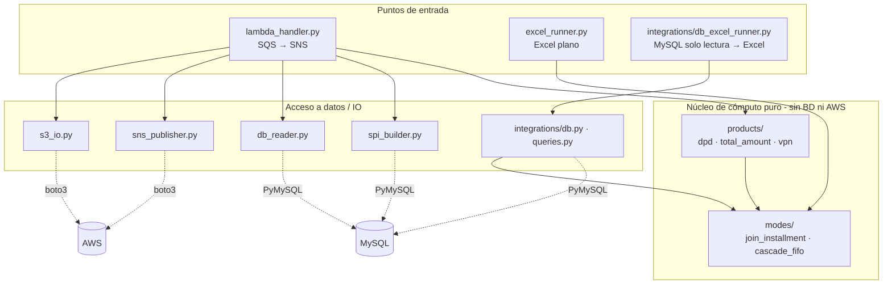

# Principios de arquitectura

Reglas de capas, dirección de dependencias y qué puede importar qué en el paquete `dpd/`.

## Idea central: núcleo de cómputo puro + 3 puntos de entrada

El cálculo de DPD **no conoce ni BD ni AWS**. La lógica pura vive en `modes/` y `products/` y opera sobre
listas de dicts o DataFrames ya sanitizados. Tres puntos de entrada distintos alimentan ese núcleo:

## Reglas de dependencia

| Capa | Puede importar | NO debe importar |
|------|----------------|------------------|
| `modes/` (cómputo puro) | `config.RunConfig`, stdlib (`Decimal`, `datetime`) | pandas, boto3, otros módulos de IO |
| `products/` (cómputo puro) | `modes/`, `excel_runner` (helpers de sanitización), pandas | boto3, `db_reader`, `s3_io` |
| `excel_runner.py` (núcleo compartido) | `config`, `modes/`, pandas | boto3, PyMySQL |
| `db_reader.py`, `spi_builder.py` | `config`, `integrations/db`, pandas | boto3, `modes/`, `products/` |
| `s3_io.py`, `sns_publisher.py` | boto3, pandas, `models` | PyMySQL, `modes/` |
| `lambda_handler.py` (orquestador) | todo lo anterior | — (es la cima) |
| `integrations/db_excel_runner.py` | `excel_runner`, `integrations/db`, `config` | `lambda_handler` |

**Dirección**: los puntos de entrada dependen del núcleo y del IO; el núcleo no depende de nadie hacia afuera.

## Doble punto de entrada en cada módulo de cómputo

Cada modo (`modes/join_installment.py`, `modes/cascade_fifo.py`) expone **dos funciones**:

- `compute(conn, cfg)` — trae los datos vía SQL (depende de MySQL).
- `compute_from_data(installments, payments, cfg)` — **lógica pura** sobre listas de dicts. Es la que se testea
  y la que reutilizan los puntos de entrada Excel y los productos.

`compute()` siempre delega en `compute_from_data()` tras leer la BD. Nunca dupliques la lógica entre ambas.

## Dónde NO meter lógica de negocio

- `integrations/db.py` es un wrapper fino de PyMySQL. **No** pongas SQL de negocio ahí — el SQL vive junto a su
  consumidor (en `db_reader.py`, en cada modo, o en `integrations/queries.py`).
- `s3_io.py` / `sns_publisher.py` solo serializan/transportan. La construcción del mensaje vive en `models.py`.

Ver [project-structure.md](project-structure.md) para el árbol de carpetas comentado.
