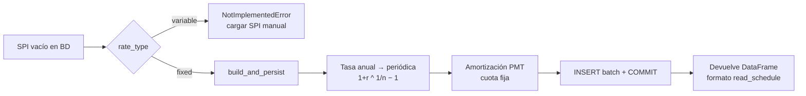

# Productos y generación de SPI

Los "productos" son columnas derivadas que se agregan al loan tape (una fila por contrato). Viven en
`dpd/products/`. La Lambda calcula solo los pedidos en `metadata.products`.

## Productos disponibles

| Producto | Módulo | Columna(s) que agrega | Insumos |
|----------|--------|------------------------|---------|
| `dpd` | [products/dpd.py](../../dpd/products/dpd.py) | `dpd_current`, `dpd_max`, `amount_in_arrears` | SPI, payments, output previo (para `dpd_max`) |
| `total_amount` | [products/total_amount.py](../../dpd/products/total_amount.py) | `total_amount_paid` | payments |
| `vpn` | [products/vpn.py](../../dpd/products/vpn.py) | `vpn` | SPI, `interest_rate` del mensaje |

`SUPPORTED_PRODUCTS = {"dpd", "total_amount", "vpn"}` en `lambda_handler.py`. Un producto desconocido aborta el mensaje.

### `dpd`
Corre el modo de cálculo (default `cascade`), agrega por contrato (`dpd_current` = max DPD, `amount_in_arrears`
= suma de arrears solo en cuotas con `dpd > 0`) y calcula el high-watermark:

- Con `previous_output` que tenga columna `dpd_max`: `dpd_max = max(dpd_current, dpd_max_previo)`.
- Sin output previo (primer run): `dpd_max = dpd_current`.

### `total_amount`
Suma `total_payment` por contrato. Pagos con `total_payment <= 0` se descartan.

### `vpn` — Valor Presente Neto
`VPN = Σ [ gross_amount_i / (1 + r)^(t_i) ]` sobre **cuotas futuras** (`date > calc_date`), con `t_i` en años
(`días/365.25`). `r` es `metadata.interest_rate` (tasa del tranche). Si `r` es None o 0 → VPN = suma sin descuento.

## Generación automática de SPI — [spi_builder.py](../../dpd/spi_builder.py)

Cuando la Lambda consulta `scheduled_payments_installments` y está **vacía** para la compañía (primer run de un
originador), y `rate_type='fixed'`, se genera el calendario desde el loan tape y se persiste en MySQL.

**Columnas requeridas en el loan tape** (configurables vía `LoanTapeColumns`):

| Columna | Descripción |
|---------|-------------|
| `borrower_contract_id` | Identificador del crédito |
| `original_principal` | Monto original desembolsado |
| `num_installments` | Número de cuotas |
| `interest_rate` | Tasa anual efectiva (ej. `0.24` = 24%) |
| `first_installment_date` | Fecha de la primera cuota |
| `periodicity` | `monthly`/`biweekly`/`weekly`/`daily` (default `monthly` si vacío) |

**Fórmulas:**
- Tasa periódica: `(1 + r_anual)^(1/n) − 1`, con `n` = períodos/año (`monthly`=12, `biweekly`=26, `weekly`=52, `daily`=365).
- PMT (cuota fija): `pmt = P × r / (1 − (1+r)^−n)`. Tasa 0 → capital puro en partes iguales.
- La **última cuota** absorbe los centavos de redondeo (liquida el saldo).

Para `rate_type='variable'` el SPI debe cargarse manualmente — la Lambda lanza `NotImplementedError`.

Ver el flujo completo de la Lambda en [how-to-run/execute.md](../how-to-run/execute.md).
