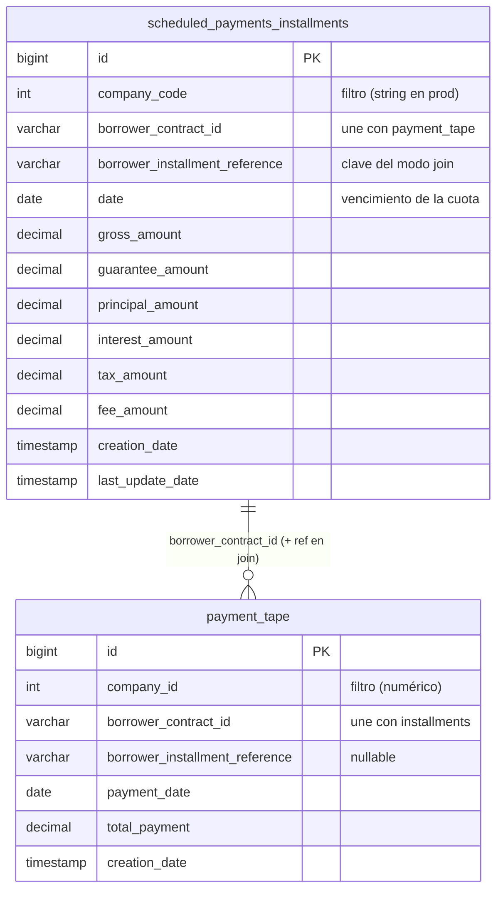

# Modelo de datos

Dos tablas MySQL alimentan el cálculo. El subset documentado aquí es el que toca `dpd/` — prod tiene más
columnas (los runners hacen `SELECT *` y el sanitizador toma solo lo necesario). Schema de referencia para
tests: [tests/schema.sql](../../tests/schema.sql).

## Diagrama

## Relación entre tablas

- Se relacionan por **`borrower_contract_id`** (y además por `borrower_installment_reference` en el modo `join`).
- **No** se unen por compañía: cada tabla filtra por su propia columna y con tipos distintos —
  `payment_tape.company_id` (numérico) vs `scheduled_payments_installments.company_code` (string). Ver
  [business/glossary.md](../business/glossary.md#filtro-por-compañía--dos-columnas-que-no-coinciden).

## Buckets de `gross_amount`

`gross_amount = guarantee + principal + interest + tax + fee`. Si una cuota viene sin desglose, el sanitizador
vuelca todo el `gross_amount` a `principal_amount`. `moratory_interest` no existe del lado SPI (es 0).

## Columnas que escribe el job

`dpd_current`, `dpd_max` y `amount_in_arrears` **no** están en el schema base de tests — las agrega el proceso
de migración en prod (comentario en `schema.sql`). El runner Lambda las calcula y las escribe en el loan tape
de S3, no necesariamente de vuelta en MySQL.

## Notas de compatibilidad SQL

- Las queries son compatibles con **MySQL 5.7+** donde se indica (modo join evita CTEs).
- `db_reader.PAYMENTS_SQL` usa una **window function** (`MAX(...) OVER (PARTITION BY ...)`) → requiere MySQL 8.

No hay framework de migraciones en el repo; el schema de prod se gestiona fuera de este proyecto.
