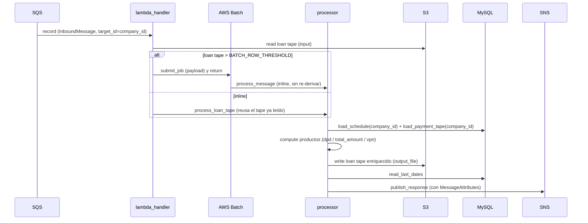

# Cómo correr el proyecto

DPD lee los datos de cálculo desde `payments_db`. Python 3.10+ (usa `X | None`, `list[dict]`). El núcleo de
procesamiento ([processor.py](../../dpd/processor.py)) es compartido por dos puntos de entrada productivos
(AWS Lambda y AWS Batch) y por un runner local para pruebas.

## Instalación

```bash
python -m venv .venv
source .venv/bin/activate
pip install -r requirements.txt
cp .env.example .env   # completar credenciales de BD (ver configuration/environment-variables.md)
```

## 1. Como Lambda (Payments Expand)

Entry point `handler(event, context)` en [lambda_handler.py](../../dpd/lambda_handler.py). Escucha SQS, decide
si procesar inline o derivar a AWS Batch, calcula y publica en SNS.



Pasos por record SQS: parsear → validar → leer loan tape de S3 → **si supera `BATCH_ROW_THRESHOLD`, encolar
job de Batch y retornar**; si no, procesar inline. El procesamiento (en `processor`) lee payments_db por
`company_id` (= `target_id`), calcula productos, agrega trazabilidad (`last_update_date`, `payment_tape_ref`),
escribe S3 y publica SNS. Si algún record falla, se relanza `RuntimeError` para que SQS reintente (acotado por
DLQ + `maxReceiveCount`).

> La decisión de derivar a Batch vive **solo** en `lambda_handler`. El job de Batch usa `processor` directamente,
> que no conoce el umbral, así que procesa inline y nunca vuelve a encolar otro job.

## 2. Como job de AWS Batch

Para loan tapes grandes. Entry point `python -m dpd.batch_handler`, recibe el payload por `--payload` o por la
variable de entorno `DPD_BATCH_PAYLOAD`:

```bash
python -m dpd.batch_handler --payload '{"origin": "ENRICHER", "target": "PAYMENTS_EXPAND", ...}'
```

Ejecuta el mismo `processor.process_message` que el camino inline de la Lambda.

## 3. Runner local (sin AWS real)

Para probar el flujo desde un evento JSON:

```bash
python -m dpd.local_runner --event evento.json          # ejecuta el handler
python -m dpd.local_runner --event evento.json --dry-run # solo parsea/valida
```

Variables requeridas (Lambda/Batch): `SNS_RESPONSE_TOPIC_ARN`, credenciales de BD vía Secrets Manager,
`BATCH_JOB_QUEUE` / `BATCH_JOB_DEFINITION` / `BATCH_ROW_THRESHOLD`. Ver
[configuration/environment-variables.md](../configuration/environment-variables.md).

## Tests

Ver [testing/run-tests.md](../testing/run-tests.md): `./scripts/run-tests.sh` (Docker).
