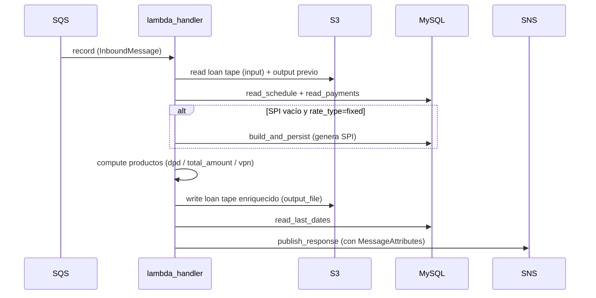

# Cómo correr el proyecto

DPD tiene tres puntos de entrada que comparten el mismo núcleo de cómputo. Python 3.10+ (usa `X | None`,
`list[dict]`).

## Instalación

```bash
python -m venv .venv
source .venv/bin/activate
pip install -r requirements.txt
cp .env.example .env   # completar credenciales de BD (ver configuration/environment-variables.md)
```

## 1. Desde Excel (sin BD ni AWS)

```bash
python -m dpd.excel_runner \
    --schedule "tests/Days Past Due.xlsx" \
    --payment-tape "tests/Days Past Due.xlsx" \
    --date 2026-10-03 \
    --mode cascade \
    --out resultado_dpd.xlsx
```

Flags: `--mode {cascade,join,both}`, `--grace-days N`, `--partial-counts`, `--schedule-sheet`, `--pt-sheet`.
Genera un Excel con dos hojas: `schedule_con_dpd` (detalle por cuota) y `resumen_por_contrato`.

## 2. Desde MySQL (solo lectura → Excel)

Análisis del día anterior de una compañía. Pregunta `company_id`/`company_code` si no se pasan:

```bash
python -m dpd.integrations.db_excel_runner \
    --company-id 86 --company-code sistecredito --date 2026-06-01
```

Flags adicionales: `--mode` (default `both`), `--grace-days`, `--partial-counts`, `--dbname`, `--out`.
**Solo lectura** — no escribe en la BD. Corte por defecto: ayer.

## 3. Como Lambda (Payments Expand)

Entry point `handler(event, context)` en [lambda_handler.py](../../dpd/lambda_handler.py). Escucha SQS, calcula, publica en SNS.



Pasos (uno por record SQS): parsear → validar → leer S3 + output previo → leer MySQL (o generar SPI) →
calcular productos → agregar trazabilidad (`last_update_date`, `payment_tape_ref`) → escribir S3 → publicar SNS.
Si algún record falla, se relanza `RuntimeError` para que SQS reintente el batch.

Variables requeridas: `SNS_RESPONSE_TOPIC_ARN` + `DB_*`. Ver
[configuration/environment-variables.md](../configuration/environment-variables.md).

## Tests

Ver [testing/run-tests.md](../testing/run-tests.md). El script configurado (`./scripts/run-tests.sh`) **aún no
existe** — generarlo con `/sdd.util.makeruntest`.
