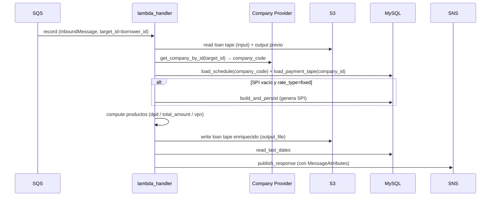

# Cómo correr el proyecto

DPD lee los datos de cálculo desde `payments_db` (ya no desde archivos Excel). Python 3.10+ (usa `X | None`,
`list[dict]`). Hay dos puntos de entrada que comparten el mismo núcleo de cómputo.

## Instalación

```bash
python -m venv .venv
source .venv/bin/activate
pip install -r requirements.txt
cp .env.example .env   # completar credenciales de BD (ver configuration/environment-variables.md)
```

## 1. Desde MySQL (solo lectura → Excel)

Análisis del día anterior de una compañía. Pregunta `company_id`/`company_code` si no se pasan:

```bash
python -m dpd.integrations.db_excel_runner \
    --company-id 86 --company-code sistecredito --date 2026-06-01
```

Lee `scheduled_payments_installments` (por `company_code`) y `payment_tape` (por `company_id`) vía los loaders
canónicos `excel_runner.load_schedule`/`load_payment_tape`. Flags adicionales: `--mode` (default `both`),
`--grace-days`, `--partial-counts`, `--dbname`, `--out`. **Solo lectura** — no escribe en la BD. Corte por defecto: ayer.

## 2. Como Lambda (Payments Expand)

Entry point `handler(event, context)` en [lambda_handler.py](../../dpd/lambda_handler.py). Escucha SQS, calcula, publica en SNS.



Pasos (uno por record SQS): parsear → validar → leer S3 + output previo → resolver `company_code` con el
Company Provider (`company_id = target_id`) → leer payments_db (o generar SPI) → calcular productos → agregar
trazabilidad (`last_update_date`, `payment_tape_ref`) → escribir S3 → publicar SNS.
Si algún record falla, se relanza `RuntimeError` para que SQS reintente el batch.

Variables requeridas en Lambda/Batch: `SNS_RESPONSE_TOPIC_ARN`, `SECRET_NAME` (credenciales BD vía Secrets
Manager). Ver [configuration/environment-variables.md](../configuration/environment-variables.md).

## Tests

Ver [testing/run-tests.md](../testing/run-tests.md): `./scripts/run-tests.sh` (Docker).
